# Multiscale Bioparticle Transport Framework

[](LICENSE)
[](01_microscale_md/)
[](02_continuum_transport/biotransport-rs/)
[](02_continuum_transport/python/)

A rigorous, end-to-end multiscale computational framework bridging **Microscale Coarse-Grained Molecular Dynamics (Martini 3 / GROMACS)** with **Macroscale Continuum Transport Phenomena and Membrane Fouling (High-Performance Rust Solver + Python API)**.

---

## 1. Overview & Multiscale Paradigm

The biophysical processing of macromolecular condensates (e.g., Elastin-Like Polypeptides (ELPs), lipid nanoparticles, and proteolipid assemblies) spans **eight orders of magnitude in time and length scales**:

```
[10^-9 m / 10^-9 s]               [10^-6 m / 10^-3 s]            [10^-3 m / 10^3 s]
Molecular Dynamics (CG)      -->  Mesoscale Hydrodynamics   -->  Continuum Transport & Fouling
(Martini 3 / GROMACS)             (Droplet / Virial Bridge)      (Rust Darcy-Starling 1D PDE)
```

1. **Microscale MD (`01_microscale_md`):** Simulates sequence-dependent peptide collapse, droplet coacervation, and shear alignment in Martini 3. Directly extracts constitutive physical properties ($R_h$, $\rho_p$, $D_0$, $B_2$, $\mu$).
2. **Standardized Parameter Bridge (`data/sample_md_params.json`):** Encapsulates microscale results into a strictly validated schema.
3. **Macroscale Continuum Solver (`02_continuum_transport/biotransport-rs`):** High-performance Rust engine solving 1D transient convection-diffusion equations across concentration polarization boundary layers and predicting permeate flux $J(t)$ decline under compressible cake fouling.

```mermaid
flowchart LR
    subgraph Microscale ["01_microscale_md (GROMACS / Martini 3)"]
        A["(VPGVG)n / Lipid Topology"] --> B["NPT Thermal/Solvent Quench"]
        B --> C["NEMD Couette Shear"]
        C --> D["extract_transport_params.py"]
    end

    subgraph Bridge ["Physical Parameter Contract"]
        D --> E["transport_params.json\n(Rh, rho_p, D0, B2, eta)"]
    end

    subgraph Macroscale ["02_continuum_transport (Rust biotransport-rs)"]
        E --> F["Carman-Kozeny & Virial Closures"]
        F --> G["1D Boundary Layer PDE Solver"]
        G --> H["Darcy-Starling Resistance-in-Series"]
        H --> I["Process Metrics: J(t), Cake Mass, Rejection"]
    end
```



---

## 2. Governing Equations

### A. Microscale Parameter Extraction
* **Hydrodynamic Radius ($R_h$):**
  $$R_h = \frac{k_B T}{6 \pi \eta_s D_0}, \quad D_0 = \lim_{t \to \infty} \frac{\langle |\mathbf{r}(t) - \mathbf{r}(0)|^2 \rangle}{6t}$$
* **Particle / Condensate Density ($\rho_p$):**
  $$\rho_p = \frac{M_{\text{cluster}}}{V_{\text{cluster}}} = \frac{\sum_i m_i}{\frac{4}{3} \pi R_g^3}$$

### B. Macroscale Continuum Transport
* **1D Transient Convection-Diffusion Boundary Layer:**
  $$\frac{\partial C(y, t)}{\partial t} = \frac{\partial}{\partial y}\left( D(C) \frac{\partial C}{\partial y} \right) + v_w(t) \frac{\partial C}{\partial y}$$
  * Boundary Condition at Membrane Surface ($y = 0$):
    $$J(t) C_w + \left. D(C_w) \frac{\partial C}{\partial y} \right|_{y=0} = J(t) C_p \approx 0$$
  * Boundary Condition at Bulk Boundary ($y = \delta$):
    $$C(\delta, t) = C_b$$

* **Darcy-Starling Permeate Flux with Resistance-in-Series:**
  $$J(t) = \frac{\Delta P - \sigma \Delta \Pi(C_w)}{\mu(C_w) \cdot \left( R_m + R_{\text{cake}}(t) \right)}$$

* **Specific Cake Resistance (Carman-Kozeny with Compressibility):**
  $$r_{c0} = \frac{180 (1 - \epsilon)^2}{\rho_p \cdot (2 R_h)^2 \cdot \epsilon^3}, \quad R_{\text{cake}}(t) = r_{c0} (\Delta P)^n M_{\text{cake}}(t)$$

* **Osmotic Pressure EOS (Carnahan-Starling / Second Virial):**
  $$\Pi(C) = \frac{R_g T}{M_w} C + B_2 C^2$$

---

## 3. Directory Layout

```text
multiscale-bioparticle-transport/
├── README.md
├── LICENSE
├── pyproject.toml
├── Makefile
├── data/
│   ├── sample_md_params.json
│   └── benchmark_filtration_data.csv
├── 01_microscale_md/
│   ├── README.md
│   ├── topologies/
│   │   ├── martini_v3.0.0.itp
│   │   ├── elp_vpgvg.itp
│   │   └── build_elp_topology.py
│   ├── mdp/
│   │   ├── em.mdp
│   │   ├── npt_equilibration.mdp
│   │   ├── quench_coacervation.mdp
│   │   └── shear_nemd.mdp
│   ├── scripts/
│   │   ├── run_md_pipeline.py
│   │   └── extract_transport_params.py
│   └── tests/
│       └── test_extract_params.py
├── 02_continuum_transport/
│   ├── biotransport-rs/           # Rust High-Performance Engine
│   │   ├── Cargo.toml
│   │   ├── src/
│   │   │   ├── lib.rs
│   │   │   ├── main.rs
│   │   │   ├── types.rs
│   │   │   ├── models/
│   │   │   │   ├── carman_kozeny.rs
│   │   │   │   ├── osmotic_pressure.rs
│   │   │   │   └── rheology.rs
│   │   │   └── solvers/
│   │   │       ├── boundary_layer_1d.rs
│   │   │       └── tff_process.rs
│   │   └── tests/
│   └── python/                    # Python Bindings & Visualization
│       ├── biotransport/
│       │   ├── bridge.py
│       │   ├── visualize.py
│       │   └── cli.py
│       └── tests/
├── scripts/
│   └── remote_run_on_agni.sh
└── notebooks/
    └── multiscale_bioparticle_demo.ipynb
```

---

## 4. Quickstart

### A. Python Environment
```bash
pip install -e .
```

### B. Rust Solver Engine
```bash
cd 02_continuum_transport/biotransport-rs
cargo build --release
cargo test
```

### C. Run End-to-End Continuum Simulation from MD Parameters
```bash
# Using Rust CLI binary
./target/release/biotransport-cli run --params ../../data/sample_md_params.json --tmp 200000 --time 3600 --out results.json

# Using Python CLI
python -m biotransport run --params data/sample_md_params.json --plot flux_profile.png
```

---

## 5. References

* **Kjølbye, L. R., et al. (2024/2026).** *"Martini 3 building blocks for lipid nanoparticle design."* *J. Chem. Theory Comput.* [DOI: 10.1021/acs.jctc.5c01207](https://doi.org/10.1021/acs.jctc.5c01207)
* **Macromolecules (2023).** *"Coacervate Formation of Elastin-like Polypeptides in Explicit Aqueous Solution Using Coarse-Grained Molecular Dynamics Simulations."* *Macromolecules*, 56(18), 7543–7555. [DOI: 10.1021/acs.macromol.3c01174](https://doi.org/10.1021/acs.macromol.3c01174)
* **Bacchin, P., et al. (2006).** *"Critical and sustainable fluxes in membrane filtration: Definitions, literature review, and new analysis."* *J. Membr. Sci.*, 281(1-2), 42–69. [DOI: 10.1016/j.memsci.2006.04.014](https://doi.org/10.1016/j.memsci.2006.04.014)
