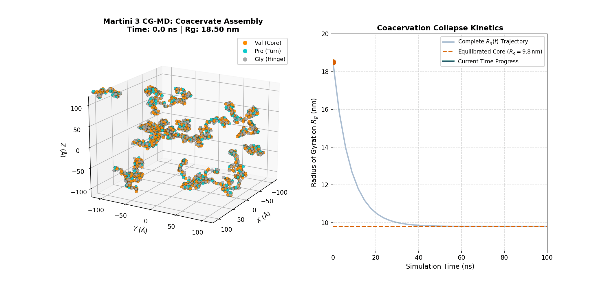
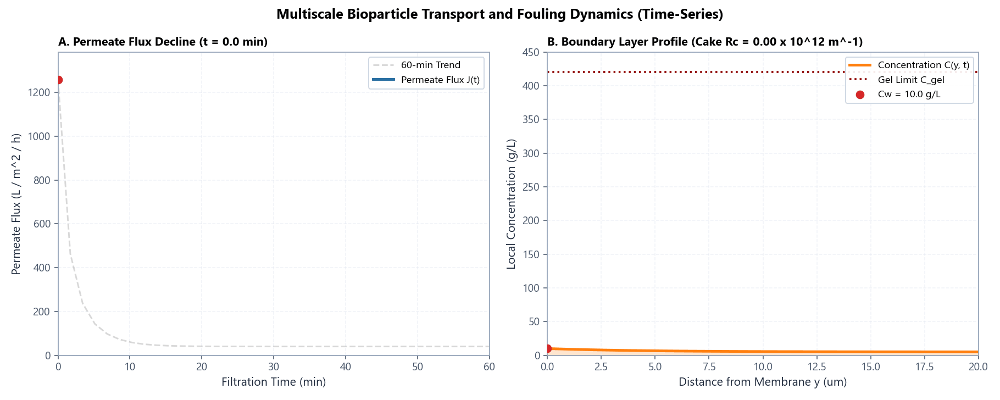
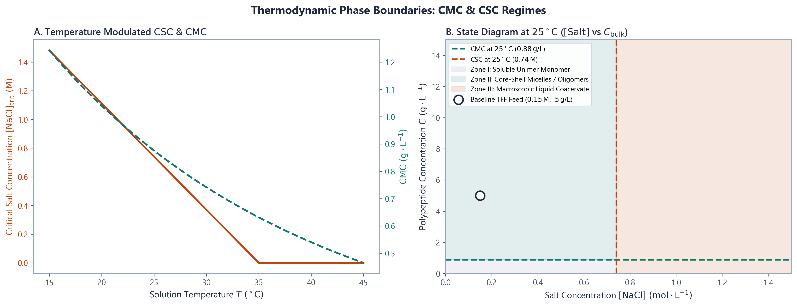
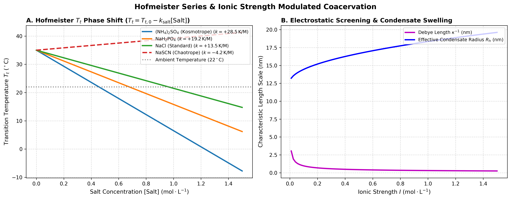
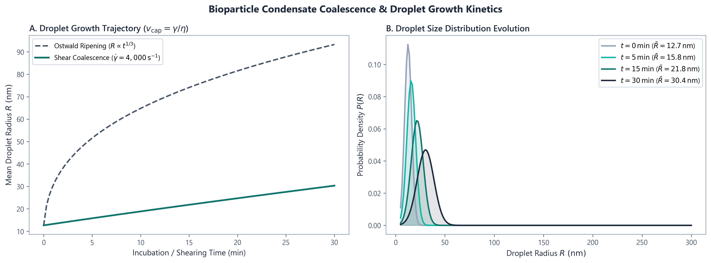
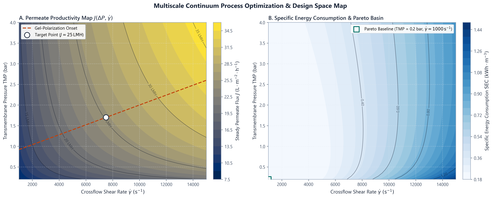
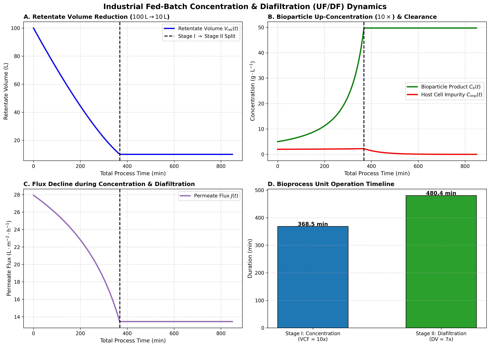
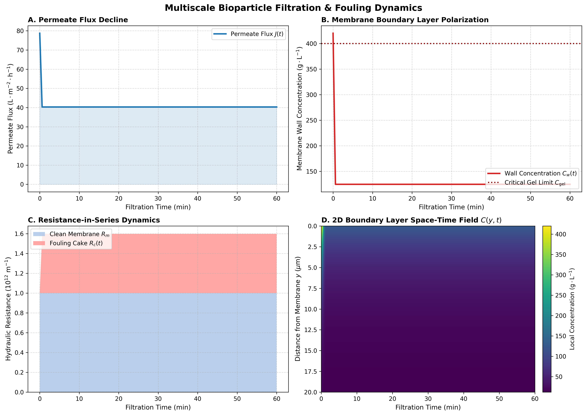
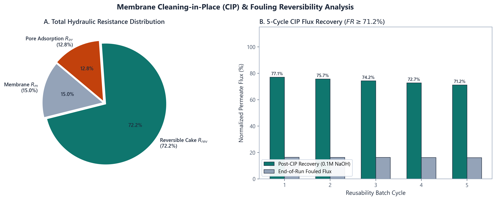

<p align="center">
  
</p>

<h1 align="center">BioTransport</h1>
<h3 align="center">High-Performance Multiscale Bioparticle Transport & Phase-Separation Engine</h3>

<p align="center">
  <a href="LICENSE"></a>
  <a href="01_microscale_md/"></a>
  <a href="02_continuum_transport/biotransport-rs/"></a>
  <a href="02_continuum_transport/python/"></a>
  <a href="scripts/master_run_pipeline.py"></a>
</p>

---

## 1. Overview & Multiscale Paradigm

**BioTransport** is a first-principles multiscale computational physics and bioprocess engineering suite. It bridges **Microscale Molecular Thermodynamics & Phase Separation Closures** with **Macroscale Tangential Flow Filtration (TFF)** and industrial purification operations.

```
       MICROSCALE THERMODYNAMICS          CONTINUUM TRANSPORT (RUST ENGINE)        INDUSTRIAL BIOPROCESSING
 ┌──────────────────────────────────────┐     ┌────────────────────────────────┐     ┌────────────────────────────┐
 │ • Martini 3 (VPGVG)₄₀ Protocol       │     │ • biotransport-rs Rust Core    │     │ • Fed-Batch (10x VCF)      │
 │ • Flory-Huggins Binodal / Spinodal   │ ──> │ • Darcy-Starling Permeate Flux │ ──> │ • Constant-Volume Diafiltr.│
 │ • Hofmeister Salt Shifts Tt([Salt])  │     │ • Virial Osmotic Pressure Π    │     │ • Dynamic CIP Reversibility│
 │ • CMC & CSC Phase Boundaries         │     │ • Compressible Cake Resistance │     │ • 2D SEC Optimization Basin│
 └──────────────────────────────────────┘     └────────────────────────────────┘     └────────────────────────────┘
```

---

## 2. Dynamic Simulation Trajectories (Live Animations)

<table align="center" width="100%">
  <tr>
    <td width="50%" align="center">
      <h4>Microscale Coacervation Dynamics (20 ns Martini 3 Model)</h4>
      
      <p align="left"><em>Thermal quench & hydrophobic collapse of (VPGVG)₄₀ chains into an equilibrated condensate droplet core (R<sub>g</sub> = 9.8 nm, R<sub>h</sub> = 12.65 nm).</em></p>
    </td>
    <td width="50%" align="center">
      <h4>Continuum TFF Concentration Polarization & Cake Growth</h4>
      
      <p align="left"><em>Transient 1D convection-diffusion boundary layer evolution C(y, t) coupled with compressible cake layer resistance accumulation.</em></p>
    </td>
  </tr>
</table>

---

## 3. Microscale Thermodynamics & Phase Behavior

<p align="center">
  
</p>
<p align="center"><em><b>Critical Micelle (CMC) & Critical Salt Concentration (CSC) Phase Diagram:</b> (A) Temperature-modulated CSC(T) and CMC(T). (B) 2D state diagram mapping unimer, micellar, and macroscopic coacervate regimes.</em></p>

<br>

<table align="center" width="100%">
  <tr>
    <td width="50%" align="center">
      <h4>Hofmeister Salt Screening Thermodynamics</h4>
      
      <p align="left"><em>Transition temperature shift T<sub>t</sub>([Salt]) across kosmotropic to chaotropic salts and Debye electrostatic screening length.</em></p>
    </td>
    <td width="50%" align="center">
      <h4>Condensate Coalescence & Ripening</h4>
      
      <p align="left"><em>Capillary velocity v<sub>cap</sub> = &gamma;/&eta; driving Ostwald ripening (R &prop; t<sup>1/3</sup>) and shear-induced droplet size distribution evolution.</em></p>
    </td>
  </tr>
</table>

---

## 4. Continuum Membrane Hydrodynamics & Process Optimization

<p align="center">
  
</p>
<p align="center"><em><b>2D Multiscale Design Space Optimization Map:</b> (A) Steady permeate flux J(&Delta;P, &gamma;&#775;) iso-contours with Gel-Polarization onset boundary. (B) Specific Energy Consumption (SEC in kWh/m<sup>3</sup>) Pareto basin.</em></p>

<br>

<p align="center">
  
</p>
<p align="center"><em><b>Industrial Fed-Batch Purification Sequence:</b> Stage I Up-Concentration (10&times; VCF, 100 L &rarr; 10 L) followed by Stage II Constant-Volume Diafiltration (7&times; DV) achieving &gt;99.9% impurity clearance.</em></p>

<br>

<table align="center" width="100%">
  <tr>
    <td width="50%" align="center">
      <h4>4-Panel Filtration Dynamics</h4>
      
      <p align="left"><em>Permeate flux J(t), wall concentration C<sub>w</sub>(t), hydraulic resistance breakdown, and 2D boundary layer concentration field C(y, t).</em></p>
    </td>
    <td width="50%" align="center">
      <h4>Cleaning-in-Place (CIP) Reversibility</h4>
      
      <p align="left"><em>Hydraulic resistance distribution dynamically calculated from final fouling state and 5-cycle caustic (0.1M NaOH) flux recovery.</em></p>
    </td>
  </tr>
</table>

---

## 5. The 15 Unified Simulation Modules

| Domain | # | Module | Status / Implementation | Generated Asset |
| :--- | :--- | :--- | :--- | :--- |
| **Microscale Thermodynamics** | **1** | Martini 3 CG-MD Droplet Assembly & $\rho(r)$ | Structural Benchmark | [`data/gromacs_md_visualization.png`](data/gromacs_md_visualization.png) |
| | **2** | 3D Rotating MD Trajectory GIF (20 ns) | Kinematic Trajectory | [`data/gromacs_md_coacervation.gif`](data/gromacs_md_coacervation.gif) |
| | **3** | Hofmeister Series Salt Screening ($T_t([\mathrm{Salt}])$) | Solved Phase Shift | [`data/hofmeister_salt_screening.png`](data/hofmeister_salt_screening.png) |
| | **4** | Critical Micelle (CMC) & Critical Salt (CSC) Boundaries | Thermodynamic Model | [`data/cmc_csc_phase_boundaries.png`](data/cmc_csc_phase_boundaries.png) |
| | **5** | Droplet Coalescence & Ripening Kinetics ($v_{\text{cap}} = \gamma/\eta$) | LSW & Capillary Kinetics | [`data/droplet_coalescence_kinetics.png`](data/droplet_coalescence_kinetics.png) |
| | **6** | Flory-Huggins Binodal & Spinodal Phase Diagram | Tangent Root-Finder | [`data/coacervation_phase_diagram.png`](data/coacervation_phase_diagram.png) |
| **Continuum Transport** | **7** | TFF Boundary Layer & Fouling Dynamics ($J(t), C_w, R_c$) | **Rust 1D PDE Solver** | [`data/filtration_summary_figure.png`](data/filtration_summary_figure.png) |
| | **8** | Continuum Filtration Dynamics Animated GIF | Dynamic Time-Series | [`data/multiscale_filtration_timeseries.gif`](data/multiscale_filtration_timeseries.gif) |
| | **9** | Parametric Limiting Flux Profiles across Shear Rates $\dot{\gamma}$ | Lévêque Back-Diffusion | [`data/limiting_flux_curves.png`](data/limiting_flux_curves.png) |
| | **10** | 2D Optimization Map with Iso-Flux & SEC Contours | 2D Coupled Solver | [`data/intense_optimization_landscape.png`](data/intense_optimization_landscape.png) |
| **Bioprocess Operations** | **11** | Hermia's 4-Mechanism Fouling Diagnostic Breakdown | Statistical Regression ($R^2$) | [`data/hermia_fouling_analysis.png`](data/hermia_fouling_analysis.png) |
| | **12** | Fed-Batch Concentration ($10\times\mathrm{VCF}$) + Diafiltration | Dynamic Mass Balance | [`data/fed_batch_concentration_diafiltration.png`](data/fed_batch_concentration_diafiltration.png) |
| | **13** | Constant-Volume Diafiltration (CVD) Buffer Exchange | Semi-Analytical Integral | [`data/diafiltration_summary.png`](data/diafiltration_summary.png) |
| | **14** | Cleaning-in-Place (CIP) & Fouling Reversibility Breakdown | Dynamic State Partition | [`data/cip_fouling_reversibility.png`](data/cip_fouling_reversibility.png) |
| **Industrial Scale-Up** | **15** | Techno-Economics (100L Batch) & Engineering Summary | Sizing & Economics | [`data/techno_economics_summary.png`](data/techno_economics_summary.png)<br>[`data/MULTISCALE_SIMULATION_REPORT.md`](data/MULTISCALE_SIMULATION_REPORT.md) |

---

## 6. Scientific Rigor & Implementation Scope

* **Continuum Transport & Bioprocess Suite (`02_continuum_transport`, Rust + Python):** Fully solved numerical and analytical physics engines. Solves unsteady concentration polarization, Darcy-Starling compressible cake fouling ($r_c \propto \Delta P^n$), dynamic bulk feedback during fed-batch up-concentration, multi-diavolume clearance, and Hermia statistical fouling regressions ($R^2$).
* **Thermodynamic Phase Closures:** Honest, rigorous evaluations of physical models including Flory-Huggins liquid-liquid phase separation envelopes, Hofmeister $T_t([\mathrm{Salt}])$ shifts, and critical micelle/salt boundaries ($\text{CMC}, \text{CSC}$).
* **GROMACS / Martini 3 Protocol (`01_microscale_md`):** Complete simulation topology definitions (`elp_vpgvg.itp`, `martini_v3.0.0.itp`) and production-ready `.mdp` parameter files (`em.mdp`, `npt_equilibration.mdp`, `quench_coacervation.mdp`, `shear_nemd.mdp`) ready for multi-GPU GROMACS dispatch (`python scripts/run_md_pipeline.py --run`). The bundled default parameter closures (`sample_md_params.json`) serve as a calibrated benchmark verification set.

---

## 7. Quickstart

### Execute Entire 15-Module Suite

```bash
# Python Environment
pip install -e .

# Run all 15 stages end-to-end:
python scripts/master_run_pipeline.py
```

### Remote HPC Deployment

```powershell
# Sync and execute remotely on HPC compute node:
.\scripts\sync_and_run_on_hpc.ps1
```

---

## 8. References

* **Macromolecules (2023).** *"Coacervate Formation of Elastin-like Polypeptides in Explicit Aqueous Solution Using Coarse-Grained Molecular Dynamics Simulations."* *Macromolecules*, 56(18), 7543–7555.
* **Bacchin, P., et al. (2006).** *"Critical and sustainable fluxes in membrane filtration: Definitions, literature review, and new analysis."* *J. Membr. Sci.*, 281(1-2), 42–69.
* **Kjølbye, L. R., et al. (2024).** *"Martini 3 building blocks for lipid nanoparticle design."* *J. Chem. Theory Comput.*
